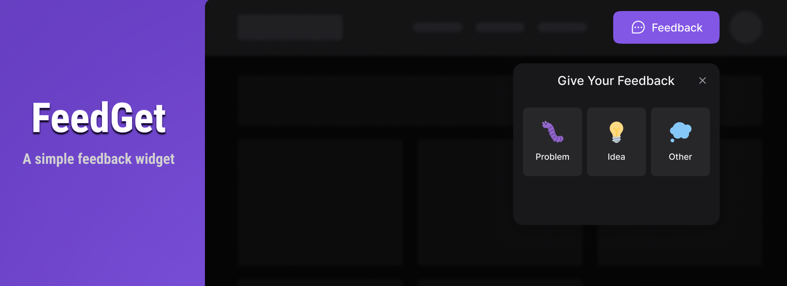

<div align='justify'>



> A widget to facilitate the sending of feedbacks, developed using React.js and TailwindCSS.

#
- [About](#about)
- [Using](#using)
- [Techs](#techs)
- [Learned](#learned)
- [Credits](#credits)
- [License](#license)
#

<br>

## **About**

For any company, receiving feedback is extremely important to know how to improve their product. For any customer, giving feedback is extremely important to tell them how the product can be better. Thinking in this way, FeedGet aims to make a bridge between the two sides, facilitating this communication between customer and company.

## **Using**

### Install Requirements

- Nodejs v16+

### Run

Install all dependencies:

```bash
npm i
```

Run website in development mode:

```bash
npm run dev:web
```

Prisma - Create Migration
```bash
npx prisma migrate dev
```

Prisma Run Studio
```bash
npx prisma studio
```

## **Techs**

### Shared

- [Lerna](https://github.com/lerna/lerna)
- [Editorconfig](https://editorconfig.org/)
- [TypeScript](https://www.typescriptlang.org/)
- [Jest](https://jestjs.io/)

### Frontend

&rarr; `./packages/web`

- [React.js](https://reactjs.org/)
  - Start using [Vite.js](https://vitejs.dev/guide/)
- [Tailwind CSS](https://tailwindcss.com/)
  - Plugins: [tailwind-scrollbar](https://www.npmjs.com/package/tailwind-scrollbar)
  - [postcss](https://github.com/postcss/postcss) and [autoprefixer](https://github.com/postcss/autoprefixer)
- [Phosphor Icons](https://github.com/phosphor-icons/phosphor-home#phosphor-icons)
- [Headless UI](https://headlessui.dev/)
- [HTML 2 Canvas](https://github.com/niklasvh/html2canvas)

### Backend

&rarr; `./packages/api`

- [Node.js](https://nodejs.org/en/)
- [Express](https://expressjs.com/)
- [Prisma](https://www.prisma.io/)
- [SQLite](https://www.sqlite.org/index.html)
- [Nodemailer](https://nodemailer.com/)
- [SWC/Jest](https://swc.rs/docs/usage/jest)

## **Tools**

- [Insomnia](https://insomnia.rest/)
- [Mailtrap](https://mailtrap.io/)


## **Learned**

- Develop a Widget
- Take screenshot with html2canvas
- Accessibility
- Loading Component

## **Credits**

- The version **v1.0.0** of this project was developed at [Next Level Week](https://nextlevelweek.com) event provided by [Rocketseat](https://www.rocketseat.com.br/)
- The project layout was developed by [Ilana Mallak](https://www.figma.com/@ilanamallak)

## **License**

[MIT](./LICENSE)

</div>
